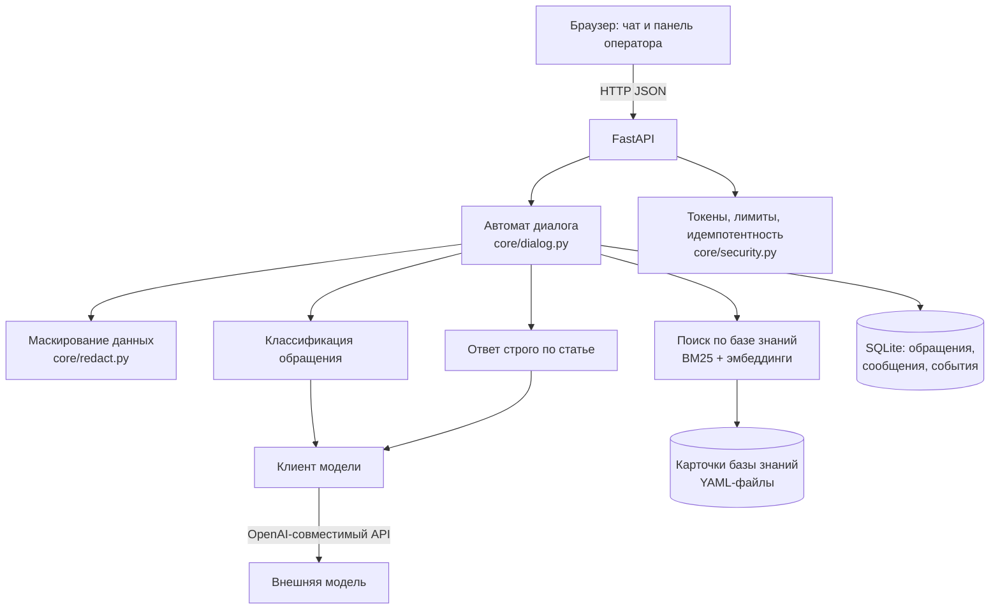

# «Помоги мне» — виртуальный помощник техподдержки

Решение кейса 2 хакатона **re:action stack** (ТПУ × Актион).

| | |
|---|---|
| 💬 **Чат с помощником** | https://helpme-tpu.duckdns.org |
| 🛠 **Панель оператора** | https://helpme-tpu.duckdns.org/operator |
| 📘 **Документация API** | https://helpme-tpu.duckdns.org/docs |

Работает по этим ссылкам прямо сейчас, открывается с телефона.

---

## Что делает

Сотрудник описывает проблему своими словами. Помощник понимает, о чём речь, задаёт
вопрос только если без ответа решение неприменимо, и выдаёт инструкцию по шагам.
Не справился — собирает карточку обращения и передаёт живому специалисту, который
продолжает тот же диалог из панели.

Главное требование задания:

> Пользователь должен получить решение максимально быстро и с минимальным
> количеством действий.

Мы сделали это метрикой: **среднее число действий пользователя до решения** считает
сама система, оно на видном месте в панели.

---

## Сильные стороны

**Помощник не выдумывает.** Шаги берутся из карточки базы знаний. Модель может
переформулировать их под ситуацию, но не может добавить свои: код проверяет, что
шагов не стало больше, и отбрасывает ссылку на статью, которой не было в выдаче
поиска. Нет подходящей статьи — так и написано, а не придуманная инструкция.

**Вопрос задаётся, только если без него никак.** В карточке перечислено, что нужно
знать именно для этого решения. Известное система не переспрашивает. Жёсткий потолок —
два уточняющих вопроса за диалог. У 22 карточек из 40 обязательных вопросов нет вовсе:
решение приходит сразу.

**Шаги идут по одному, с кнопками «Получилось» / «Не получилось».** Система знает,
на каком именно шаге всё встало, и передаёт это специалисту.

**Уверенность честная.** Процент относится к подобранной статье. Статьи нет — стоит
прочерк, а не красивое число. Ниже порога 0,75 система не гадает, а предлагает
выбрать категорию кнопками.

**Нецелевые обращения закрываются сами.** Вопросы не про ИТ, хамство, набор символов.
Первое такое сообщение получает объяснение, чем помощник занимается — человек мог
ошибиться окном. Второе закрывает обращение. Специалиста такие обращения не занимают
и метрику не портят.

**Диалог не теряется.** Закрыли вкладку или обновили страницу — при возвращении
помощник предложит продолжить с того же места: переписка и шаги на экране,
кнопки работают. Обращение не превращается в потерянную заявку, которую никто
уже не найдёт.

**Данные не заперты внутри.** Выгрузка в CSV и JSON, вебхук во внешнюю систему,
ссылка на обращение с управляемым доступом.

**Провайдер модели меняется одной строкой конфигурации.** Эндпоинт
OpenAI-совместимый, поэтому переезд на модель в контуре заказчика — это настройка,
а не переписывание.

---

## Панель оператора

Вход по адресу [/operator](https://helpme-tpu.duckdns.org/operator), пароль — у команды.
Четыре вкладки.

### Обращения

Таблица всех обращений: время, категория, уверенность в подобранной статье, статус,
число действий пользователя, оценка. Фильтры по категории, статусу и тексту.
Клик по строке открывает карточку.

В карточке — всё, что система узнала: категория и статья, ответы пользователя,
выданные шаги, полная переписка. Кнопки «Скачать JSON» и «Открыть доступ по ссылке»
(создаёт ссылку, которую можно отправить коллеге, и так же одним щелчком закрыть).

### Очередь

Обращения, которые ждут человека, старые сверху. Видно, у какого из них решения
в базе не нашлось. Кнопка «Взять в работу» убирает обращение из очереди, чтобы двое
не делали одно и то же.

Очередь обновляется сама: новая заявка появляется у специалиста без перезагрузки
страницы, счётчик на вкладке считает, сколько человек ждут прямо сейчас.

**Ответ пользователю прямо отсюда.** Внизу карточки поле ответа. Специалист пишет —
пользователь видит реплику в своём чате через несколько секунд, помеченную как ответ
специалиста, и может ответить. Бот в эту переписку не вмешивается, он её доставляет.
Ни почты, ни звонка, ни повторного объяснения проблемы.

### Аналитика

Среднее число действий до решения, доля решённых без специалиста, распределение по
категориям, средняя оценка, время до первого шага решения, точность классификации,
сколько нецелевых обращений отсеяно, сколько заявок ждёт человека прямо сейчас.

### База знаний

Поиск по карточкам — то же, что видит сам помощник.

Рядом — **список пробелов**: реальные обращения, для которых статьи не нашлось или
статья не помогла. Тут же форма: заполнить категорию, заголовок, симптомы и шаги —
и карточка сразу попадает в поиск, без перезапуска и без разработчика. Следующий
пользователь с той же проблемой получит готовое решение.

Это замкнутый цикл: система сама показывает, чего ей не хватает, поддержка закрывает
пробел за минуту, база растёт на реальных обращениях.

---

## Как устроено



Диалог ведёт конечный автомат: определить проблему → уточнить недостающее → выдать
шаги → проверить результат → закрыть или передать человеку. Состояние считает **только
сервер**: полей `state` и `confidence` нет в схеме запроса, продиктовать их снаружи
нельзя.

Модель вызывается дважды и на узких задачах: лёгкая определяет категорию и что ещё
нужно спросить, посильнее — переписывает шаги статьи под ситуацию. Содержание решений
задаёт база знаний, которую ведёт поддержка. Уберите модель — останется поиск,
но система не начнёт врать.

| Слой | Выбор |
|---|---|
| Backend | Python 3.11, FastAPI, Pydantic v2 |
| Хранилище | SQLite + SQLAlchemy 2.0 |
| Поиск | rank-bm25 + эмбеддинги, объединение через RRF |
| Frontend | HTML, CSS, JavaScript без сборки и без CDN |
| Развёртывание | Docker Compose + Caddy, HTTPS автоматически |

---

## Метрики

Считаются системой, видны на вкладке «Аналитика» и в `GET /api/stats`.

| Метрика | Значение |
|---|---|
| Полнота поиска по базе знаний | 40 из 40 — нужная статья всегда в топ-5 |
| Точность определения категории | 90% (36 из 40) |
| Доля обращений без уточняющих вопросов | 55% |
| Статей в базе знаний | 40 плюс добавленные оператором |
| Проверок защиты API пройдено | 15 из 15 — [docs/SECURITY.md](docs/SECURITY.md) |
| Проверок поведения системы | 29 из 29 — `python tests/test_new_features.py` |
| Стоимость обработки обращения | ≈ 0,24 ₽ |
| Среднее число действий до решения | считается системой |

Четыре промаха классификатора пришлись на одну границу каталога: «рабочее место»
против «оборудования» — «компьютер не включается», «синий экран». Тут и живой инженер
ответит по-разному, а инструкцию пользователь всё равно получает правильную: шаги
выбирает найденная статья, а не ярлык категории.

---

## Безопасность

Организаторы отдельно потребовали, чтобы приложение нельзя было сломать запросами
в обход браузера. Принцип простой: **клиент ничего не решает**.

| Попытка | Результат |
|---|---|
| Чужой или выдуманный номер обращения | `404` — снаружи не отличить «нет доступа» от «нет обращения» |
| Прислать своё состояние или уверенность | Полей нет в схеме, они отбрасываются |
| Писать в закрытое обращение | `409` |
| Повторный запрос (двойной клик, ретрай) | Тот же ответ, дубля нет |
| Сообщение длиннее 2000 символов | `422`, до модели не доходит |
| Поток запросов | `429` |
| Промпт-инъекция | Ответ модели разбирается по схеме, шаги берутся из статьи |

Полный отчёт с прогона по боевому адресу — [docs/SECURITY.md](docs/SECURITY.md),
воспроизводится командой `bash tests/attack_api.sh https://helpme-tpu.duckdns.org`.

**Данные пользователя.** Во внешнюю модель уходит текст, очищенный от почты,
телефонов, логинов, IP и номеров карт. Оригинал остаётся у нас — он нужен специалисту.
Коды ошибок и версии ОС не маскируются: без них решение невозможно.

```
Не могу зайти в почту ivanov@corp.ru, пароль qwerty123
→ Не могу зайти в почту <EMAIL>, пароль <SECRET>
```

Честная граница: регулярные выражения не распознают ФИО и стопроцентной гарантии
не дают. Это снижение риска, а не его устранение. Полностью задача решается моделью
в контуре заказчика — архитектура это позволяет.

---

## Запуск

```bash
cp .env.example .env        # вписать LLM_API_KEY и пароль оператора
docker compose up -d --build
```

Без Docker:

```bash
python -m venv .venv && .venv\Scripts\activate    # Linux: source .venv/bin/activate
pip install -r requirements.txt
uvicorn main:app --reload
```

Переменные окружения — в `.env.example`. Обязательные: `LLM_API_KEY`,
`OPERATOR_PASSWORD`, `SECRET_KEY`.

---

## Документы

- [docs/DEMO.md](docs/DEMO.md) — сценарий демонстрации на 4 минуты
- [docs/SECURITY.md](docs/SECURITY.md) — отчёт о проверке защиты API
- [docs/AI_USAGE.md](docs/AI_USAGE.md) — какие нейросети использовали и для чего

---

## Команда

| Роль | Зона ответственности |
|---|---|
| A | ядро, автомат диалога, API, база, защита, развёртывание |
| B | клиент модели, классификация, генерация ответа |
| C | база знаний, гибридный поиск, тест-набор |
| D | интерфейс чата |
| E | панель оператора, интеграции, тестирование API |

Работали contract-first: единые модели данных и сигнатуры модулей зафиксировали
в первый час, поэтому пятеро могли писать код параллельно и ничего не сломать
друг у друга.

---

## Что не сделали

Честный список — сознательно оставили за рамками суток: голосовые обращения
и распознавание скриншотов, персонализация под профиль сотрудника, полноценная
система прав, дообучение моделей на истории обращений.

Ближайшие шаги при развитии: перенос модели в контур заказчика, интеграция
с существующей Service Desk через готовый вебхук, пополнение базы знаний
на основе эскалаций.
