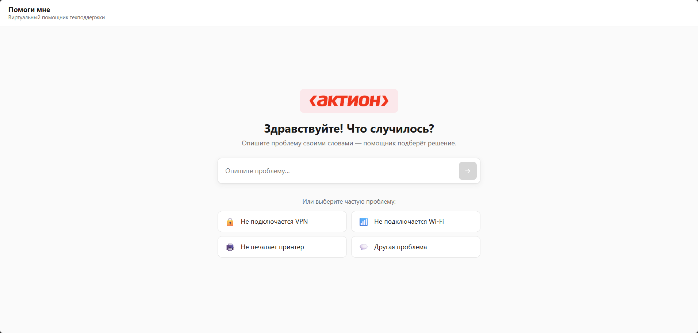
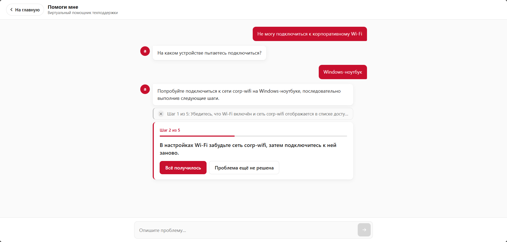
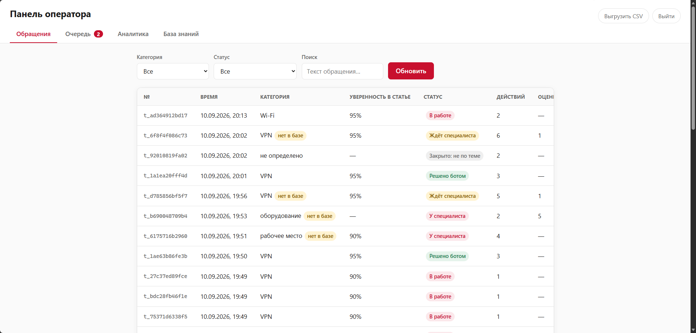
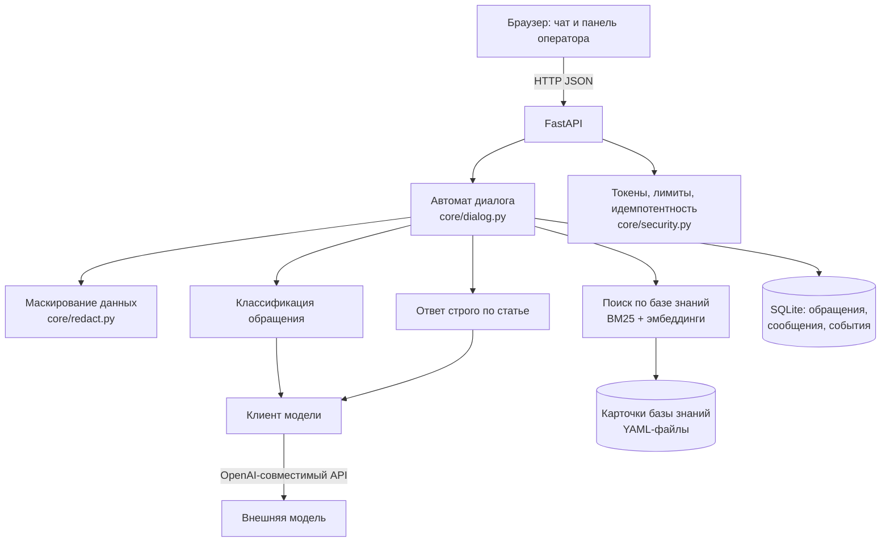

# «Помоги мне» — виртуальный помощник техподдержки

Решение кейса 2 хакатона **re:action stack** (ТПУ × Актион).

| | |
|---|---|
| 💬 **Чат с помощником** | https://helpme-tpu.duckdns.org |
| 🛠 **Панель оператора** | https://helpme-tpu.duckdns.org/operator (Пароль: SmenaPasswd2026)|
| 📘 **Документация API** | https://helpme-tpu.duckdns.org/docs |

Работает по этим ссылкам прямо сейчас, открывается с телефона.



---

## Что делает решение

Сотрудник описывает проблему своими словами. Помощник определяет, о чём речь,
задаёт вопрос только при необходимости и выдаёт инструкцию по шагам. Если решить
проблему не удаётся, создаётся карточка обращения и специалист продолжает тот же
диалог из панели.

Основное требование задания:

> Пользователь должен получить решение максимально быстро и с минимальным
> количеством действий.

Это измеряется метрикой **среднего числа действий пользователя до решения**,
которая отображается в панели.

---

## Основной сценарий

Полный путь пользователя. Его можно пройти по ссылке выше.

1. Сотрудник открывает чат и описывает проблему своими словами: «не подключается
   VPN». На главном экране также есть кнопки для трёх частых проблем.
2. Система определяет проблему. Поиск по базе знаний выдаёт пять статей-кандидатов,
   модель выбирает подходящую и указывает, каких сведений не хватает. При уверенности
   ниже 0,75 предлагается выбрать категорию кнопками.
3. Задаётся уточняющий вопрос, если без ответа решение неприменимо: «На каком
   устройстве проблема?» с вариантами ответа. Больше двух таких вопросов за диалог
   не задаётся.
4. Выдаются шаги решения. На экране один шаг, под ним кнопки «Всё получилось»
   и «Проблема ещё не решена». Шаги взяты из карточки базы знаний.
5. Проверяется результат. При успехе обращение закрывается, система предлагает
   оценить ответ и записывает число действий пользователя в метрику.
6. При неудаче подключается специалист. Формируется карточка обращения: категория,
   суть проблемы, ответы пользователя, выполненные шаги и шаг, на котором
   остановились. Обращение попадает в очередь панели.
7. Специалист отвечает из панели в тот же чат. Пользователю не нужно переходить
   в другой канал и повторно описывать проблему.

Дополнительные ветки того же сценария: обращение не по теме закрывается без вызова
специалиста; при отсутствии подходящей статьи ответ помечается как общая рекомендация,
а запрос попадает в список пробелов базы знаний; перезагрузка страницы не прерывает
диалог.

---

## Основные возможности

Шаги берутся из карточки базы знаний. Модель может переформулировать их под ситуацию,
но не может добавлять новые: код проверяет, что шагов не стало больше, и отбрасывает
ссылку на статью, которой не было в выдаче поиска. Если подходящей статьи нет, система
сообщает об этом.

Вопрос задаётся только тогда, когда без ответа решение неприменимо. В карточке указано,
что нужно знать для конкретного решения, поэтому известное система не переспрашивает.
За один диалог можно задать не больше двух уточняющих вопросов. У 22 карточек из 40
обязательных вопросов нет.

Шаги показываются по одному, с кнопками «Получилось» / «Не получилось». По результату
система определяет, на каком шаге возникла проблема, и передаёт эту информацию специалисту.



Процент уверенности относится к найденной статье. Если статья не найдена, показывается
прочерк. При значении ниже 0,75 система предлагает выбрать категорию кнопками.

Нецелевые обращения обрабатываются отдельно: вопросы не про ИТ, сообщения с оскорблениями
или набором символов. Первое такое сообщение получает пояснение о назначении помощника,
второе закрывает обращение. Такие обращения не передаются специалисту и не учитываются
в метрике.

После закрытия вкладки или обновления страницы диалог можно продолжить с того же места:
переписка и текущие шаги сохраняются, кнопки остаются доступными.

Данные можно выгружать в CSV и JSON. Также есть вебхук во внешнюю систему и ссылка
на обращение с управляемым доступом.

Провайдер модели задаётся через конфигурацию. Эндпоинт OpenAI-совместимый, поэтому
для перехода на модель в контуре заказчика не требуется менять остальную логику.

---

## Панель оператора

Вход по адресу [/operator](https://helpme-tpu.duckdns.org/operator) (Пароль: SmenaPasswd2026)



### Обращения

Таблица всех обращений: время, категория, уверенность в подобранной статье, статус,
число действий пользователя, оценка. Фильтры по категории, статусу и тексту.
Клик по строке открывает карточку.

В карточке — всё, что система узнала: категория и статья, ответы пользователя,
выданные шаги, полная переписка. Есть кнопки «Скачать JSON» и «Открыть доступ по ссылке».
Ссылка создаётся для передачи коллеге и может быть закрыта там же.

### Очередь

Сверху находятся самые старые обращения, ожидающие специалиста. Видно, у какого из них решения
в базе не нашлось. Кнопка «Взять в работу» убирает обращение из очереди, чтобы двое
не делали одно и то же.

Очередь обновляется сама: новая заявка появляется у специалиста без перезагрузки
страницы, счётчик на вкладке показывает количество обращений в ожидании.

**Ответ пользователю прямо отсюда.** Внизу карточки поле ответа. Специалист пишет —
пользователь видит реплику в своём чате через несколько секунд, помеченную как ответ
специалиста, и может ответить. Бот только доставляет сообщения. Для ответа не нужны почта, звонок или
повторное описание проблемы.

### Аналитика

Здесь отображаются среднее число действий до решения, доля решённых без специалиста,
распределение по категориям, средняя оценка, время до первого шага решения,
точность классификации, количество нецелевых обращений и число заявок,
ожидающих специалиста.

### База знаний

Поиск по карточкам использует тот же набор данных, что и помощник.

Рядом отображается список обращений, для которых статья не нашлась или не помогла.
Для таких случаев есть форма с категорией, заголовком, симптомами и шагами. После
сохранения карточка сразу появляется в поиске, без перезапуска приложения и участия
разработчика.

---

## Дополнительный функционал

Сверх основного сценария в решении реализовано следующее.

| Возможность | Где посмотреть |
|---|---|
| Оценка уверенности системы в подобранном решении | колонка в панели, поле `confidence` в ответе API |
| Отсев нецелевых обращений и закрытие без вызова специалиста | напишите помощнику вопрос не про ИТ |
| Ответ специалиста пользователю из панели | вкладка «Очередь» → карточка обращения |
| Пополнение базы знаний из панели, без перезапуска приложения | вкладка «База знаний» → список пробелов и форма |
| Выгрузка обращений в CSV и одного обращения в JSON | кнопки в панели, `GET /api/tickets/export.csv` |
| Вебхук во внешнюю систему при эскалации | переменная `WEBHOOK_URL` |
| Ссылка на обращение с управляемым доступом | переключатель «Открыть доступ по ссылке» в карточке |
| Дашборд с метриками, включая основную метрику задания | вкладка «Аналитика», `GET /api/stats` |
| Восстановление незавершённого диалога после перезагрузки | обновите страницу посреди диалога |
| Автообновление очереди у специалиста | вкладка «Очередь» обновляется сама |
| Работа без интернета на кэше ответов | переменная `DEMO_MODE` |
| Автодокументация API | https://helpme-tpu.duckdns.org/docs |

---

## Как устроено



Диалог ведёт конечный автомат: определить проблему → уточнить недостающее → выдать
шаги → проверить результат → закрыть или передать человеку. Состояние хранится на
сервере: полей `state` и `confidence` нет в схеме запроса, поэтому их нельзя передать
из клиента.

Модель вызывается дважды для разных задач: первая определяет категорию и список
недостающих данных, вторая переформулирует шаги найденной статьи под ситуацию.
Содержание решений задаётся базой знаний, которую ведёт поддержка. Без модели
останется поиск по базе знаний и остальная логика системы.

### Используемые технологии

| Слой | Выбор |
|---|---|
| Backend | Python 3.11, FastAPI, Pydantic v2 |
| Хранилище | SQLite + SQLAlchemy 2.0 |
| Поиск | rank-bm25 + эмбеддинги, объединение через RRF |
| Модель | внешняя, через OpenAI-совместимый эндпоинт (ProxyAPI) |
| Frontend | HTML, CSS, JavaScript без сборки и без CDN |
| Развёртывание | Docker Compose + Caddy, HTTPS автоматически |

Какие нейросети и на каких этапах использовала команда — в [docs/AI_USAGE.md](docs/AI_USAGE.md).

---

## Метрики

Считаются системой, видны на вкладке «Аналитика» и в `GET /api/stats`.

| Метрика | Значение |
|---|---|
| Полнота поиска по базе знаний | 40 из 40 — нужная статья всегда в топ-5 |
| Точность определения категории | 90% (36 из 40) |
| Доля обращений без уточняющих вопросов | 55% |
| Статей в базе знаний | 40 плюс добавленные оператором |
| Проверок защиты API пройдено | 15 из 15 — [docs/SECURITY.md](docs/SECURITY.md) |
| Проверок поведения системы | 29 из 29 — `python tests/test_new_features.py` |
| Стоимость обработки обращения | ≈ 0,24 ₽ |
| Среднее число действий до решения | считается системой |

Четыре промаха классификатора относятся к границе между категориями «рабочее место»
и «оборудование»: «компьютер не включается» и «синий экран». При этом итоговые шаги
выбираются по найденной статье, а не по названию категории.

---

## Безопасность

Организаторы отдельно потребовали проверять запросы, которые отправляются напрямую,
в обход браузера. Основная часть логики находится на сервере.

| Попытка | Результат |
|---|---|
| Чужой или выдуманный номер обращения | `404` — снаружи не отличить «нет доступа» от «нет обращения» |
| Прислать своё состояние или уверенность | Полей нет в схеме, они отбрасываются |
| Писать в закрытое обращение | `409` |
| Повторный запрос (двойной клик, ретрай) | Тот же ответ, дубля нет |
| Сообщение длиннее 2000 символов | `422`, до модели не доходит |
| Поток запросов | `429` |
| Промпт-инъекция | Ответ модели разбирается по схеме, шаги берутся из статьи |

Полный отчёт с прогона по боевому адресу находится в [docs/SECURITY.md](docs/SECURITY.md)
и воспроизводится командой `bash tests/attack_api.sh https://helpme-tpu.duckdns.org`.

**Данные пользователя.** Во внешнюю модель отправляется текст, очищенный от почты,
телефонов, логинов, IP и номеров карт. Оригинал хранится у нас и используется
специалистом. Коды ошибок и версии ОС не маскируются, потому что они нужны для решения.

```
Не могу зайти в почту ivanov@corp.ru, пароль qwerty123
→ Не могу зайти в почту <EMAIL>, пароль <SECRET>
```

Регулярные выражения не распознают ФИО и не дают стопроцентной гарантии. Сейчас
они используются для снижения риска. При необходимости обработку можно перенести
на модель в контуре заказчика, архитектура это позволяет.

---

## Запуск

```bash
cp .env.example .env        # вписать LLM_API_KEY и пароль оператора
docker compose up -d --build
```

Без Docker:

```bash
python -m venv .venv && .venv\Scripts\activate    # Linux: source .venv/bin/activate
pip install -r requirements.txt
uvicorn main:app --reload
```

Переменные окружения — в `.env.example`. Обязательные: `LLM_API_KEY`,
`OPERATOR_PASSWORD`, `SECRET_KEY`.

---

## Документы

- [docs/DEMO.md](docs/DEMO.md) — сценарий демонстрации на 4 минуты
- [docs/SECURITY.md](docs/SECURITY.md) — отчёт о проверке защиты API
- [docs/AI_USAGE.md](docs/AI_USAGE.md) — какие нейросети использовали и для чего

---

## Команда

| Роль | Зона ответственности |
|---|---|
| A | ядро, автомат диалога, API, база, защита, развёртывание |
| B | клиент модели, классификация, генерация ответа |
| C | база знаний, гибридный поиск, тест-набор |
| D | интерфейс чата |
| E | панель оператора, интеграции, тестирование API |

Работали по принципу contract-first: единые модели данных и сигнатуры модулей
зафиксировали в первый час. После этого пятеро могли писать код параллельно,
используя одни и те же интерфейсы между модулями.

---

## Ограничения MVP

База знаний содержит 40 карточек по семи категориям каталога услуг. Это
демонстрационный объём; механика поиска и пополнения от количества статей
не зависит.

Маскирование данных построено на регулярных выражениях и покрывает почту, телефоны,
логины, IP-адреса и номера карт. ФИО оно не распознаёт, поэтому полной гарантии
не даёт.

Хранилище — SQLite в одном процессе приложения. Для нагрузки уровня компании
потребуется PostgreSQL; на структуру кода это не влияет, меняется строка подключения.

Ролей две: пользователь и оператор. Групп, прав и журнала действий администратора нет.

Ответы специалиста доставляются опросом раз в несколько секунд, а не постоянным
соединением. Уведомлений за пределами открытой вкладки нет — ни почтой, ни пушем.

За рамками суток оставили голосовые обращения и распознавание скриншотов,
персонализацию под профиль сотрудника и дообучение моделей на истории обращений.
Мобильного приложения нет, интерфейс — адаптивный веб.

Ближайшие шаги при развитии: перенос модели в контур заказчика, интеграция
с существующей Service Desk через готовый вебхук, пополнение базы знаний
на основе эскалаций.
