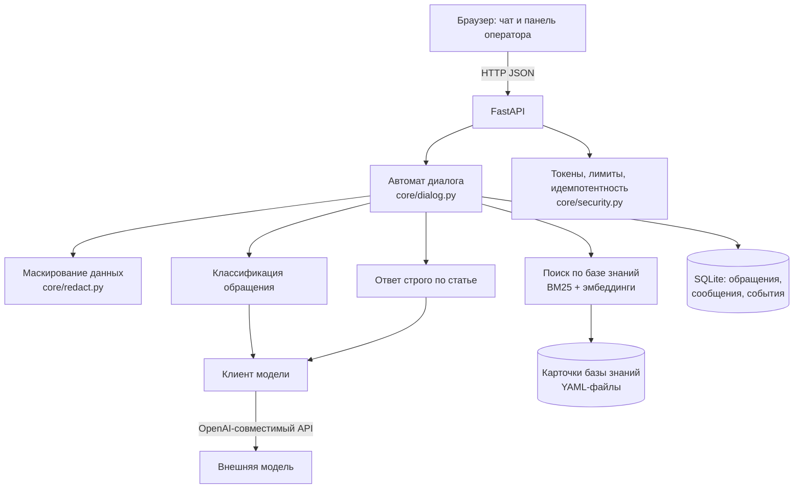

# «Помоги мне» — виртуальный помощник техподдержки

Решение кейса 2 хакатона **re:action stack** (ТПУ × Актион).

|                         |                                                                   |
| ----------------------- | ----------------------------------------------------------------- |
| 💬 **Чат с помощником** | https://helpme-tpu.duckdns.org                                    |
| 🛠 **Панель оператора** | https://helpme-tpu.duckdns.org/operator (Пароль: SmenaPasswd2026) |
| 📘 **Документация API** | https://helpme-tpu.duckdns.org/docs                               |

Работает по этим ссылкам прямо сейчас, открывается с телефона.

Пароль оператора указан в открытом виде намеренно — чтобы комиссия могла войти
без переписки с командой. После конкурса он меняется, а строка из README убирается.


---

## Для кого

Помощник — внутренняя ИТ-поддержка сотрудников. Пользователь не инженер: если бы
он умел решить проблему сам, он бы не писал в поддержку. Отсюда требование к шагам —
каждый говорит, что сделать, где именно это находится и что должно появиться
на экране.

Каталог услуг взят из задания: рабочее место, доступы, VPN, корпоративная почта,
Wi-Fi, программное обеспечение, оборудование. База знаний наполняется инструкциями
самой организации — через панель оператора, вставкой текста, без разработчика.

---

## Что делает решение

Пользователь описывает проблему своими словами. ИИ-помощник определяет, о чём речь,
и кидает в чат карточку с инструкциями из базы знаний. Если решить
проблему не удаётся, обращение передаётся специалисту в панель для оператора.

Основное требование задания:

> Пользователь должен получить решение максимально быстро и с минимальным
> количеством действий.

Это измеряется метрикой **среднего числа действий пользователя до решения**,
которая отображается в панели.

---

## Основной сценарий

Полный путь пользователя. Его можно пройти по ссылке выше.

1. Пользователь открывает чат и описывает проблему своими словами: «не подключается
   VPN». На главном экране также есть кнопки для трёх частых проблем.
2. Система определяет проблему. Если проблема по теме, то поиск по базе знаний выдаёт подходящую карточку с инструкциями для решения проблемы.
3. Выдаются шаги решения. Инструкция видна целиком, но ведёт по одному шагу:
   текущий выделен, пройденные помечены крестиком. Шаги взяты из карточки базы знаний.
4. Проверяется результат. При успехе обращение закрывается, система предлагает
   оценить ответ и записывает число действий пользователя в метрику.
5. При неудаче подключается специалист. Формируется карточка обращения: категория,
   суть проблемы, ответы пользователя, выполненные шаги и шаг, на котором
   остановились. Обращение попадает в очередь панели.
6. Специалист отвечает из панели в тот же чат. Пользователю не нужно переходить
   в другой канал и повторно описывать проблему.

---

## Основные возможности

Шаги берутся из карточки базы знаний. Модель может переформулировать их под ситуацию,
но не может добавлять новые: код проверяет, что шагов не стало больше, и отбрасывает
ссылку на статью, которой не было в выдаче поиска. Если подходящей статьи нет, система
сообщает об этом.

Вопрос задаётся только тогда, когда без ответа решение неприменимо. В карточке указано,
что нужно знать для конкретного решения, поэтому известное система не переспрашивает.
За один диалог можно задать не больше двух уточняющих вопросов. Больше половины
карточек обязательных вопросов не требуют вовсе — решение выдаётся сразу.

Инструкция показывается целиком, но ведёт по одному шагу за раз: текущий выделен,
пройденные помечены крестиком — их попробовали, и они не помогли. Так виден и весь
путь, и место, на котором пользователь сейчас. Переход между шагами происходит
в браузере, без обращения к серверу, а до результата одно нажатие: «Проблема решена»
или «Ничего не помогло». По тому, на каком шаге остановились, специалист понимает,
что уже проверено.


Процент уверенности относится к найденной статье. Если статья не найдена, показывается
прочерк. При значении ниже 0,75 система не гадает, а показывает, что нашёл поиск:
«Не уверен, что понял вопрос. Возможно, вы имеете в виду:» и три конкретные проблемы
кнопками плюс «Другое». Выбор пользователя считается точным — он сам сказал,
что у него не работает.

Нецелевые обращения обрабатываются отдельно: вопросы не про ИТ, сообщения с оскорблениями
или набором символов. Первое такое сообщение получает пояснение о назначении помощника,
второе закрывает обращение. Такие обращения не передаются специалисту и не учитываются
в метрике.

После закрытия вкладки или обновления страницы диалог можно продолжить с того же места:
переписка и текущие шаги сохраняются, кнопки остаются доступными.

**История обращений и возврат к предыдущему.** Пользователь видит свои прошлые
обращения: номер, дату, категорию, суть и исход. Любое можно открыть и прочитать
переписку целиком. Незавершённое — продолжить, закрытое — не переоткрыть, а начать
по его мотивам новое: категория, формулировка проблемы и собранные сведения
переносятся, и бот не спрашивает заново то, что уже знает. Переписка прошлого
обращения при этом видна прямо в чате.

Регистрации для этого не требуется. Обращения привязываются к анонимному
идентификатору, который выдаёт сервер и хранит браузер; в базе лежит только его
хэш, поэтому дамп базы не выдаёт чужую переписку. При внедрении на это место
встаёт корпоративный вход, и история привязывается к учётной записи.

**Путь к человеку в один клик.** Кнопка «Специалист» видна в шапке диалога всегда.
Если проблема уже описана, обращение передаётся сразу. Если пользователь просит
человека, не сказав, что случилось, помощник один раз предлагает помочь — и передаёт
специалисту, если попросили повторно. Каскад «база знаний → общий совет → человек»
остаётся путём по умолчанию, но перестаёт быть единственным.

Данные можно выгружать в CSV и JSON. Также есть вебхук во внешнюю систему и ссылка
на обращение с управляемым доступом.

Провайдер модели задаётся через конфигурацию. Эндпоинт OpenAI-совместимый, поэтому
для перехода на модель в контуре заказчика не требуется менять остальную логику.

---

## Панель оператора

Вход по адресу [/operator](https://helpme-tpu.duckdns.org/operator) (Пароль: SmenaPasswd2026)


### Обращения

Таблица всех обращений: время, категория, уверенность в подобранной статье, статус,
число действий пользователя, оценка. Фильтры по категории, статусу и тексту.
Клик по строке открывает обращение на отдельной вкладке.

Вкладка обращения устроена как рабочее место: слева переписка во всю высоту экрана
и поле ответа, справа карточка — категория и статья, ответы пользователя, выданные
шаги, статус. Там же действия: «Завершить обращение», «Скачать JSON» и «Открыть
доступ по ссылке». Ссылка создаётся для передачи коллеге и может быть закрыта там же.
Кнопка «← К списку» выходит из обращения, не закрывая его: к нему можно вернуться.

### Очередь

Сверху находятся самые старые обращения, ожидающие специалиста. Видно, у какого из них решения
в базе не нашлось. Кнопка «Взять в работу» убирает обращение из очереди, чтобы двое
не делали одно и то же, и сразу открывает диалог с пользователем.

Очередь обновляется сама: новая заявка появляется у специалиста без перезагрузки
страницы, счётчик на вкладке показывает количество обращений в ожидании.

**Ответ пользователю прямо отсюда.** Под перепиской поле ответа. Специалист пишет —
пользователь видит реплику в своём чате через несколько секунд, помеченную как ответ
специалиста, и может ответить. Бот только доставляет сообщения. Для ответа не нужны почта, звонок или
повторное описание проблемы.

### Аналитика

Период выбирается сверху: за сутки, за неделю, за месяц или за всё время.
Здесь отображаются среднее число действий до решения, доля решённых без специалиста,
распределение по категориям, полезность ответов, время до первого шага решения,
точность классификации, количество нецелевых обращений и число заявок,
ожидающих специалиста.

### База знаний

Поиск по карточкам использует тот же набор данных, что и помощник.

Рядом отображается список обращений, для которых статья не нашлась или не помогла.
Для таких случаев есть форма с категорией, заголовком, симптомами и шагами. После
сохранения карточка сразу появляется в поиске, без перезапуска приложения и участия
разработчика.

---

## Дополнительный функционал

Сверх основного сценария в решении реализовано следующее.

| Возможность                                                  | Где посмотреть                                            |
| ------------------------------------------------------------ | --------------------------------------------------------- |
| История обращений у пользователя                             | вкладка «История обращений» слева в чате                  |
| Возврат к предыдущему обращению                              | «История» → закрытое обращение → «Проблема вернулась»     |
| Поиск по базе знаний для пользователя                        | вкладка «Поиск по базе знаний» справа в чате              |
| Вызов специалиста в один клик                                | кнопка «Специалист» в шапке диалога                       |
| Поиск по смыслу, а не по совпадению слов                     | BM25 и эмбеддинги, объединение через RRF                  |
| Сборка карточки базы знаний из текста инструкции             | панель → «База знаний» → вставить текст                   |
| Оценка уверенности системы в подобранном решении             | строка над инструкцией в чате, колонка в панели, поле `confidence` |
| Метрики за выбранный период: сутки, неделя, месяц            | вкладка «Аналитика», параметр `period` в `GET /api/stats` |
| Отсев нецелевых обращений и закрытие без вызова специалиста  | напишите помощнику вопрос не про ИТ                       |
| Ответ специалиста пользователю из панели                     | вкладка «Очередь» → карточка обращения                    |
| Пополнение базы знаний из панели, без перезапуска приложения | вкладка «База знаний» → список пробелов и форма           |
| Выгрузка обращений в CSV и одного обращения в JSON           | кнопки в панели, `GET /api/tickets/export.csv`            |
| Вебхук во внешнюю систему при эскалации                      | переменная `WEBHOOK_URL`                                  |
| Ссылка на обращение с управляемым доступом                   | переключатель «Открыть доступ по ссылке» в карточке       |
| Дашборд с метриками, включая основную метрику задания        | вкладка «Аналитика», `GET /api/stats`                     |
| Восстановление незавершённого диалога после перезагрузки     | обновите страницу посреди диалога                         |
| Автообновление очереди у специалиста                         | вкладка «Очередь» обновляется сама                        |
| Работа без интернета на кэше ответов                         | переменная `DEMO_MODE`                                    |
| Автодокументация API                                         | https://helpme-tpu.duckdns.org/docs                       |

---

## Как устроено



Диалог ведёт конечный автомат: определить проблему → уточнить недостающее → выдать
шаги → проверить результат → закрыть или передать человеку. Состояние хранится на
сервере: полей `state` и `confidence` нет в схеме запроса, поэтому их нельзя передать
из клиента.

Поиск гибридный. Лексическая часть — BM25 по заголовку, категории, симптомам
и шагам карточки. Смысловая — эмбеддинги: вектора карточек считаются заранее
скриптом `tools/build_emb_index.py` и лежат в репозитории, поэтому старт приложения
не зависит от внешнего сервиса. Два ранжирования объединяются через RRF, причём оба
списка предварительно обрезаются до одной глубины: BM25 отдаёт только документы
с ненулевым скором, вектора — всю базу, и без обрезки длинный шумный список забивал
короткий и точный.

Если индекса нет, он собран другой моделью или сеть недоступна — поиск откатывается
на BM25 и пишет об этом в журнал. Приложение при этом работает.

Модель вызывается дважды для разных задач: первая определяет категорию и список
недостающих данных, вторая переформулирует шаги найденной статьи под ситуацию.
Содержание решений задаётся базой знаний, которую ведёт поддержка. Без модели
останется поиск по базе знаний и остальная логика системы.

### Используемые технологии

| Слой          | Выбор                                                 |
| ------------- | ----------------------------------------------------- |
| Backend       | Python 3.11, FastAPI, Pydantic v2                     |
| Хранилище     | SQLite + SQLAlchemy 2.0                               |
| Поиск         | rank-bm25 + эмбеддинги, объединение через RRF         |
| Модель        | внешняя, через OpenAI-совместимый эндпоинт (ProxyAPI) |
| Frontend      | HTML, CSS, JavaScript без сборки и без CDN            |
| Развёртывание | Docker Compose + Caddy, HTTPS автоматически           |

Какие нейросети и на каких этапах использовала команда — в [docs/AI_USAGE.md](docs/AI_USAGE.md).

---

## Метрики

Считаются системой, видны на вкладке «Аналитика» и в `GET /api/stats`.

| Метрика                                | Значение                                              |
| -------------------------------------- | ----------------------------------------------------- |
| Полнота поиска по базе знаний          | 17 из 18 — `python3 -m tools.check_search`            |
| То же на чисто лексическом поиске      | 15 из 18 — режим BM25 в том же прогоне                |
| Точность определения категории         | 95% (38 из 40)                                        |
| Доля обращений без уточняющих вопросов | 55%                                                   |
| Статей в базе знаний                   | 122 плюс добавленные оператором                       |
| Проверок защиты API пройдено           | 19 из 19 — [docs/SECURITY.md](docs/SECURITY.md)       |
| Проверок поведения системы             | `tests/test_new_features.py`, `tests/test_history.py` |
| Одновременные обращения                | 8 из 8 — `tests/test_concurrency.py`                  |
| Стоимость обработки обращения          | ≈ 0,24 ₽                                              |
| Среднее число действий до решения      | считается системой                                    |

Полнота поиска измеряется **не** на вопросах, составленных по карточкам: так любая
система покажет сто процентов. Проверочные запросы написаны разговорным языком,
с синонимами и опечатками, и этих слов в карточках нет — «не пускает во впн»,
«вpн не рабоатет», «бумага есть, а печати нет».

Два запроса из восемнадцати находятся только благодаря поиску по смыслу: лексический
поиск на них промахивается. Один запрос не находит ожидаемую статью — «комп гудит
и всё открывается вечность» содержит два разных симптома, и система показывает обе
подходящие карточки; это случай для уточняющего вопроса, а не промах поиска.

Точность выросла с 90% после того, как в промпт классификатора добавили правило
разграничения категорий «рабочее место» и «оборудование» — на этой границе были
все прежние промахи. Два оставшихся промаха на итог для пользователя не влияют:
шаги выбираются по найденной статье, а не по названию категории.

---

## Безопасность

Организаторы отдельно потребовали проверять запросы, которые отправляются напрямую,
в обход браузера. Основная часть логики находится на сервере.

| Попытка                                 | Результат                                                    |
| --------------------------------------- | ------------------------------------------------------------ |
| Чужой или выдуманный номер обращения    | `404` — снаружи не отличить «нет доступа» от «нет обращения» |
| Прислать своё состояние или уверенность | Полей нет в схеме, они отбрасываются                         |
| Писать в закрытое обращение             | `409`                                                        |
| Повторный запрос (двойной клик, ретрай) | Тот же ответ, дубля нет                                      |
| Сообщение длиннее 2000 символов         | `422`, до модели не доходит                                  |
| Поток запросов                          | `429`                                                        |
| Промпт-инъекция                         | Ответ модели разбирается по схеме, шаги берутся из статьи    |
| Запрос чужой истории обращений          | Пустой список и `200` — перебором не отличить живой идентификатор от выдуманного |
| Возврат к чужому обращению по номеру    | `404` — нужен ещё и токен обращения                          |

Полный отчёт с прогона по боевому адресу находится в [docs/SECURITY.md](docs/SECURITY.md)
и воспроизводится командой `bash tests/attack_api.sh https://helpme-tpu.duckdns.org`.

**Данные пользователя.** Во внешнюю модель отправляется текст, очищенный от почты,
телефонов, логинов, IP и номеров карт. Оригинал хранится у нас и используется
специалистом. Коды ошибок и версии ОС не маскируются, потому что они нужны для решения.

```
Не могу зайти в почту ivanov@corp.ru, пароль qwerty123
→ Не могу зайти в почту <EMAIL>, пароль <SECRET>
```

Регулярные выражения не распознают ФИО и не дают стопроцентной гарантии. Сейчас
они используются для снижения риска. При необходимости обработку можно перенести
на модель в контуре заказчика, архитектура это позволяет.

---

## Запуск

```bash
cp .env.example .env        # вписать LLM_API_KEY и пароль оператора
docker compose up -d --build
```

Без Docker:

```bash
python -m venv .venv && .venv\Scripts\activate    # Linux: source .venv/bin/activate
pip install -r requirements.txt
uvicorn main:app --reload
```

Переменные окружения — в `.env.example`. Обязательные: `LLM_API_KEY`,
`OPERATOR_PASSWORD`, `SECRET_KEY`.

---

## Документы

- [docs/DATA.md](docs/DATA.md) — где лежат данные и как они хранятся
- [docs/DEMO.md](docs/DEMO.md) — сценарий демонстрации на 4 минуты
- [docs/SECURITY.md](docs/SECURITY.md) — отчёт о проверке защиты API
- [docs/AI_USAGE.md](docs/AI_USAGE.md) — какие нейросети использовали и для чего

---

## Команда

| Роль | Зона ответственности                                    |
| ---- | ------------------------------------------------------- |
| A    | ядро, автомат диалога, API, база, защита, развёртывание |
| B    | клиент модели, классификация, генерация ответа          |
| C    | база знаний, гибридный поиск, тест-набор                |
| D    | интерфейс чата                                          |
| E    | панель оператора, интеграции, тестирование API          |

Работали по принципу contract-first: единые модели данных и сигнатуры модулей
зафиксировали в первый час. После этого пятеро могли писать код параллельно,
используя одни и те же интерфейсы между модулями.

---

## Ограничения MVP

База знаний содержит 122 карточки по семи категориям каталога услуг. Шаги написаны
под неподготовленного читателя, но это всё же демонстрационный объём: инструкции
универсальные, а не выверенные под конкретную организацию. Механика поиска
и пополнения от количества статей не зависит — карточка собирается из текста
инструкции прямо в панели.

Маскирование данных построено на регулярных выражениях и покрывает почту, телефоны,
логины, IP-адреса и номера карт. ФИО оно не распознаёт, поэтому полной гарантии
не даёт.

Хранилище — SQLite в одном процессе приложения. Для нагрузки уровня компании
потребуется PostgreSQL; на структуру кода это не влияет, меняется строка подключения.

Ролей две: пользователь и оператор. Групп, прав и журнала действий администратора нет.
Регистрации пользователя нет намеренно: она добавляет действий, а решению проблемы
не помогает. История обращений держится на анонимном идентификаторе, и при внедрении
её место занимает корпоративный вход.

Ответы специалиста доставляются опросом раз в несколько секунд, а не постоянным
соединением. Уведомлений за пределами открытой вкладки нет — ни почтой, ни пушем.

За рамками суток оставили голосовые обращения и распознавание скриншотов,
персонализацию под профиль сотрудника и дообучение моделей на истории обращений.
Мобильного приложения нет, интерфейс — адаптивный веб.

Ближайшие шаги при развитии: перенос модели в контур заказчика, интеграция
с существующей Service Desk через готовый вебхук, пополнение базы знаний
на основе эскалаций.
