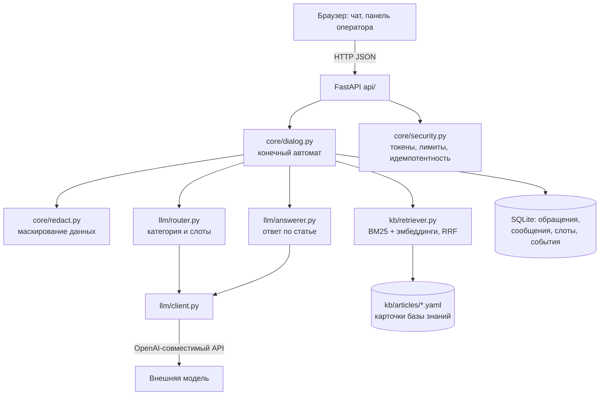
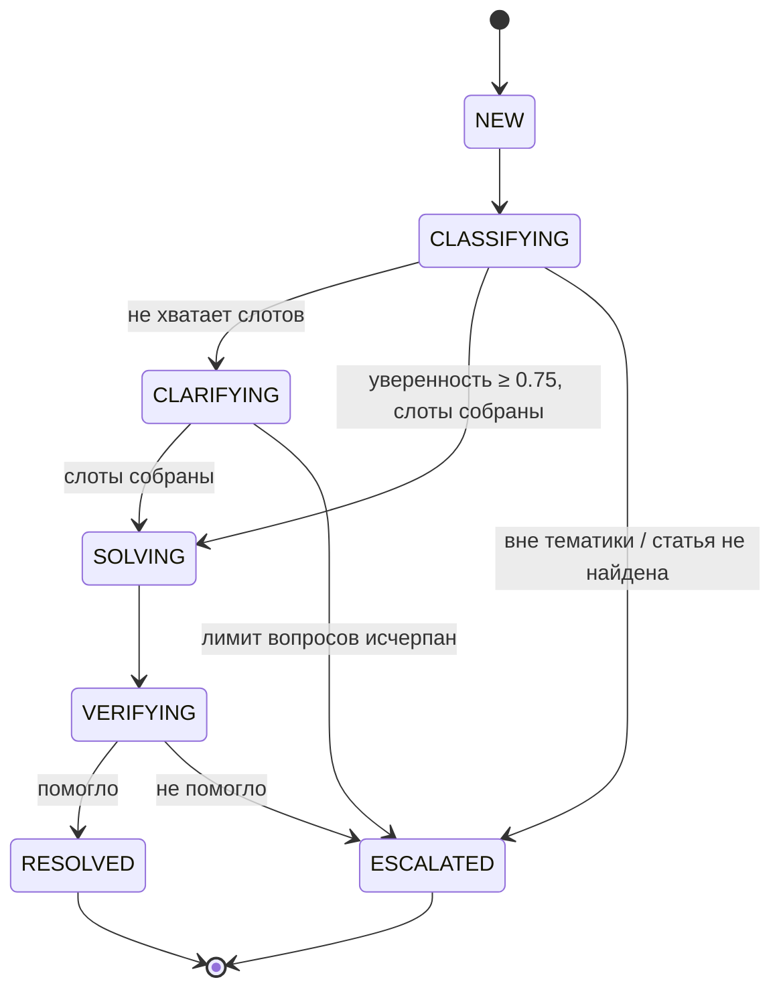

# «Помоги мне» — виртуальная техническая поддержка

Решение кейса 2 хакатона **re:action stack** (ТПУ × Актион).

**Живой продукт:** https://helpme-tpu.duckdns.org
**Панель оператора:** https://helpme-tpu.duckdns.org/static/admin.html
**Документация API:** https://helpme-tpu.duckdns.org/docs

---

## Задача

В техническую поддержку ежедневно приходят обращения, значительную часть которых можно
решить без участия специалиста. Но сначала нужно понять проблему, определить категорию,
запросить недостающие данные, найти решение и объяснить, что делать. На практике это
занимает время и создаёт нагрузку на инженеров.

Главная цель из технического задания:

> Пользователь должен получить решение своей проблемы максимально быстро
> и с минимальным количеством действий.

Мы сделали эту формулировку метрикой продукта: **среднее число действий пользователя
до решения** считается системой и выведено на дашборд.

---

## Это не ChatGPT

Пять решений, которые отличают наш подход.

### 1. Спрашиваем только то, без чего решение неприменимо

В карточке базы знаний перечислены `required_slots` — сведения, необходимые именно для
этого решения. Система сравнивает их с уже известными и задаёт вопрос только про
недостающие. Жёсткий лимит — **не более двух уточняющих вопросов за диалог**.

Это правило в коде

```yaml
required_slots:
  - key: os
    question: "На каком устройстве проблема?"
    options: ["Windows", "macOS", "Android", "iOS"]
  - key: error_code
    question: "Есть ли код ошибки на экране?"
    optional: true
```

### 2. Ответы только из базы знаний, с указанием источника

Шаги решения берутся из конкретной статьи. Модель их переформулирует под контекст
пользователя, но **не сочиняет**. Две страховки стоят в коде:

- статья, которой не было среди найденных кандидатов, отбрасывается — модель не может
  сослаться на несуществующий документ;
- если модель вернула шагов больше, чем есть в статье, берутся шаги статьи как есть.

Нет подходящей статьи — эскалация.

### 3. Пошаговый гид вместо стены текста

Шаги показываются по одному, с кнопками «Получилось» / «Не получилось». Система узнаёт,
на каком именно шаге всё остановилось, и передаёт это специалисту.

### 4. Видимая уверенность системы

Под ответом — категория и уверенность в процентах. Если уверенность ниже порога,
система предлагает выбрать категорию кнопками.

### 5. Карточка обращения, готовая к передаче

При эскалации автоматически формируется карточка: категория, суть проблемы, собранные
ответы пользователя, выполненные шаги. Специалисту не нужно ничего переспрашивать.

---

## Архитектура

За образец взята архитектура «Альфа-Помощника» Альфа-Банка — те же слои в масштабе
хакатона: каналы, распознавание интента, база знаний с RAG, интеграции, эскалация
с сохранением истории.



### Конечный автомат диалога

Состояние вычисляется **только сервером**. В модели запроса полей `state` и `confidence`
нет — клиент физически не может их продиктовать.



| Состояние | Что происходит |
|---|---|
| `CLASSIFYING` | гибридный поиск даёт топ-5 статей, модель возвращает категорию, статью, уверенность и недостающие слоты |
| `CLARIFYING` | один вопрос про недостающий слот, по возможности кнопками; счётчик не больше двух |
| `SOLVING` | шаги статьи переписываются под контекст пользователя |
| `VERIFYING` | «Получилось?» — да ведёт в `RESOLVED`, нет в `ESCALATED` |
| `RESOLVED` / `ESCALATED` | формируется карточка обращения, при эскалации уходит вебхук |

---

## Безопасность

### Защита от некорректных запросов

Организаторы отдельно потребовали, чтобы приложение нельзя было сломать запросами
в обход браузера. Базовый принцип: **клиент ничего не решает**.

| Попытка | Результат |
|---|---|
| Чужой или выдуманный `ticket_id` | `404` — снаружи не отличить «нет доступа» от «нет обращения» |
| Прислать `state` или `confidence` | Поля отсутствуют в схеме, Pydantic их отбрасывает |
| Ответить в уже закрытом обращении | `409`, состояние в базе не меняется |
| Повторный `request_id` (двойной клик, ретрай) | Тот же ответ, дубля сообщения нет |
| Сообщение длиннее 2000 символов | `422`, до бизнес-логики и модели не доходит |
| Более 20 запросов в минуту | `429` |
| Промпт-инъекция | Ответ модели используется как данные по схеме; шаги берутся из статьи |
| Необработанный сбой | `500` с кодом вида `9dc2ffdf`, трейсбек остаётся в логах |

### Маскирование данных перед отправкой в модель

Оригинал обращения хранится у нас — он нужен специалисту. Наружу уходит очищенный текст.

```
Не могу зайти в почту ivanov@corp.ru, пароль qwerty123
→ Не могу зайти в почту <EMAIL>, пароль <SECRET>

Принтер 192.168.1.45 не печатает, логин CORP\petrov
→ Принтер <IP> не печатает, логин <LOGIN>

Не работает VPN, ошибка 0x80072ee7 на Windows 11
→ без изменений
```

Коды ошибок, версии ОС и названия программ не маскируются: без них решение невозможно.
В журнал пишутся счётчики срабатываний.

**Честная граница:** регулярные выражения не распознают ФИО и не дают стопроцентной
гарантии. Это снижение риска, а не его устранение. Полностью задача решается моделью
в контуре заказчика — и архитектура это позволяет: провайдер меняется одной переменной
`LLM_BASE_URL`, код не трогается.

---

## Технологический стек

| Слой | Выбор | Почему |
|---|---|---|
| Backend | Python 3.11, FastAPI, Uvicorn | автодокументация из коробки, Pydantic для валидации |
| Валидация | Pydantic v2 | ответ модели проверяется по схеме, невалидный JSON не доходит до пользователя |
| Хранилище | SQLite + SQLAlchemy 2.0 | ноль настройки, работает офлайн, объём данных этого не требует большего |
| Поиск | rank-bm25 + эмбеддинги, объединение через RRF | на объёме базы знаний векторная БД избыточна, всё считается в памяти |
| LLM | OpenAI-совместимый API | две модели: лёгкая на классификацию, сильнее на генерацию |
| Frontend | HTML + CSS + JavaScript без сборки | никаких зависимостей от внешней сети во время демонстрации |
| Развёртывание | Docker Compose + Caddy | HTTPS автоматически, запуск одной командой |

---

## Метрики

Считаются системой, доступны на `GET /api/stats` и на вкладке «Аналитика».

| Метрика | Значение |
|---|---|
| Среднее число действий пользователя до решения | _заполнить_ |
| Доля обращений, решённых без уточняющих вопросов | 55% (22 карточки из 40 не требуют слотов) |
| Полнота поиска по базе знаний (40 тест-кейсов) | 40 из 40 |
| Точность определения категории на тест-наборе | _заполнить_ |
| Средняя оценка ответа пользователями | _заполнить_ |
| Стоимость обработки одного обращения | ≈ 0,24 ₽ |

---

## Запуск

### Локально

```bash
python -m venv .venv && source .venv/bin/activate   # Windows: .venv\Scripts\activate
pip install -r requirements.txt
cp .env.example .env
uvicorn main:app --reload
```

### В Docker

```bash
cp .env.example .env
docker compose up -d --build
```

### Переменные окружения

```
LLM_BASE_URL=https://api.proxyapi.ru/v1
LLM_API_KEY=...
LLM_MODEL_FAST=...          # классификация
LLM_MODEL_SMART=...         # генерация ответа
CONFIDENCE_THRESHOLD=0.75
MAX_CLARIFYING_QUESTIONS=2
WEBHOOK_URL=                # куда отправлять карточку при эскалации
DEMO_MODE=0
```

---

## Структура репозитория

```
common/models.py     единые модели данных, контракт между модулями
core/dialog.py       конечный автомат диалога
core/security.py     токены, лимиты, идемпотентность
core/redact.py       маскирование данных
api/                 HTTP-эндпоинты
db/                  таблицы и доступ к данным
llm/                 клиент модели, классификация, генерация ответа
kb/articles/         карточки базы знаний (данные, не код)
static/              чат и панель оператора
tests/               тест-набор и регресс-прогон
docs/AI_USAGE.md     отчёт об использовании нейросетей
```

---

## Команда

| Роль | Зона ответственности |
|---|---|
| A | ядро, автомат диалога, API, база, защита, развёртывание |
| B | клиент модели, классификация, генерация ответа |
| C | база знаний, гибридный поиск, тест-набор |
| D | интерфейс чата |
| E | панель оператора, интеграции, тестирование API, защита проекта |

Работа велась contract-first: единые модели данных и сигнатуры модулей были
зафиксированы в первый час, что позволило пятерым работать параллельно.
Использованные нейросети и распределение задач между ними — в [docs/AI_USAGE.md](docs/AI_USAGE.md).

---

## Что не реализовано

Честный список — эти вещи мы сознательно оставили за рамками суток:

- голосовые обращения и распознавание скриншотов;
- персонализация ответа под профиль пользователя;
- полноценная система прав и админка (есть только ссылка с управляемым доступом);
- дообучение моделей на истории обращений.

Ближайшие шаги при развитии: перенос модели в контур заказчика, интеграция
с существующей Service Desk через готовый вебхук, пополнение базы знаний
на основе эскалаций.